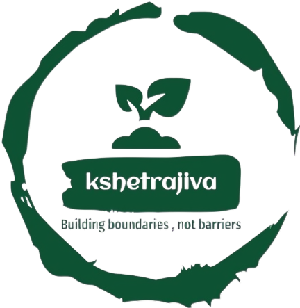

# Kshetrajiva - Krushisev



## 🌾 Project Overview

Kshetrajiva is a modern solution for agricultural land protection systems designed to address human-wildlife conflicts in farming. This web application showcases products and services that help farmers protect their crops from wild animals through detection and deterrence systems.

## 🚀 Features

- **Product Catalog**: Browse a variety of agricultural protection products
- **User Authentication**: Register and login with OTP verification
- **Educational Content**: Learn about human-wildlife conflicts through news articles and videos
- **Responsive Design**: Optimized for both desktop and mobile devices
- **Shopping Cart**: Add products to cart for purchase

## 💻 Tech Stack

- **Frontend**: HTML, CSS, JavaScript
- **Framework**: React
- **Build Tool**: Vite
- **UI Components**: Custom components with Bootstrap elements
- **Dependencies**:
  - React Router DOM
  - Emotion (for styling)

## 🏗️ Project Structure

```
krushisev-main/
├── 404-notfound/       # 404 error page
├── Footer/             # Footer component
├── LoginTop/           # Authentication components
│   ├── login/          # Login and registration
│   ├── aboutus/        # About us page
│   └── contactus/      # Contact page
├── Navbar/             # Navigation component
├── Profile/            # User profile components
├── Team/               # Team information
├── cart/               # Shopping cart functionality
├── img/                # Image assets
├── products/           # Product listings
├── src/                # Source code
└── style.css           # Global styles
```

## 🚀 Getting Started

### Prerequisites

- Node.js (v14 or higher)
- npm or yarn

### Installation

1. Clone the repository:
   ```bash
   git clone https://github.com/ShashankNCoder/Kshetrajiva.git
   cd Kshetrajiva
   ```

2. Install dependencies:
   ```bash
   npm install
   ```

3. Start the development server:
   ```bash
   npm run dev
   ```

4. Open your browser and navigate to:
   ```
   http://localhost:3000
   ```

## 📱 Usage

1. **Browse Products**: Explore the various agricultural protection products on the homepage
2. **Create Account**: Register to access additional features
3. **Learn More**: Read news articles and watch videos about human-wildlife conflict solutions
4. **Contact**: Reach out through the contact form for more information

## ✨ Key Solutions

- **Smart Detection Camera**: Advanced camera systems for detecting animal presence
- **Chemical Deterrents**: Non-harmful chemical solutions to repel animals
- **Sound Systems**: Specialized speakers that emit sounds to deter wildlife
- **Integrated Protection**: Combined solutions for comprehensive farm protection

## 👥 Target Audience

- Farmers in regions with high human-wildlife conflicts
- Agricultural businesses seeking protection solutions
- Conservation organizations working on human-wildlife coexistence

## 🔮 Future Enhancements

- Integration with real payment gateways
- Mobile application development
- IoT integration for real-time monitoring
- Expanded product catalog with more solutions
- User reviews and ratings system

## 📄 License

This project is licensed under the MIT License - see the LICENSE file for details.

## 📞 Contact

- Email: kshetr.jiva24@gmail.com
- Website: [Kshetrajiva](https://ksetrajiva.github.io/Gitam/)
- Phone: +91 8217800894 / 8105857049
- Address: GITAM, Bengaluru, Karnataka-560001, India

---

© 2023 Kshetrajiva - Solving Human-Wildlife Conflicts
